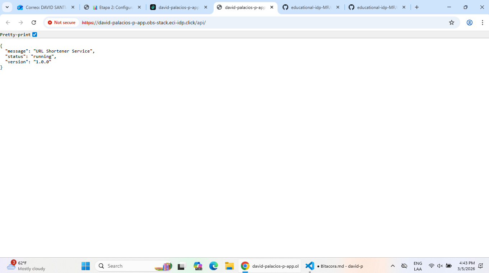
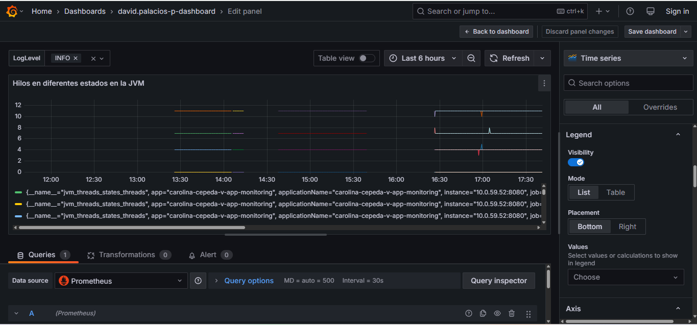
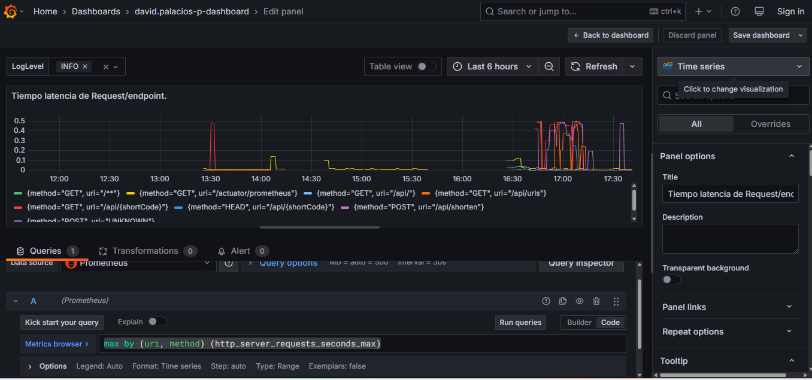

# Bitácora Experimento - Observabilidad y Monitoreo

**Nombre del estudiante:** _____________________________  
---
Cuando acabes no olvides ayudarnos evaluando tu ⭐[experiencia](https://forms.office.com/r/JCyhCpujrt)⭐
---

## Tabla de Contenidos
- [Etapa 1: Preparación del Ambiente](#etapa-1-preparación-del-ambiente)
- [Etapa 2: Métricas Iniciales](#etapa-2-métricas-iniciales)
- [Etapa 2.1: Dashboard Base en Grafana](#etapa-21-dashboard-base-en-grafana)
- [Etapa 2.2: Propuesta de Métrica Personalizada](#etapa-22-propuesta-de-métrica-personalizada)
- [Etapa 3: Experimentación y Análisis del Sistema](#etapa-3-experimentación-y-análisis-del-sistema)

---

## Etapa 1: Preparación del Ambiente

### 1.1. Información de la aplicación

DNS: https://david-palacios-p-app.obs-stack.eci-idp.click/api/ 

### 1.2. Verificación del despliegue

**¿La aplicación se desplegó correctamente?** 

- [ X ] Sí
- [ ] No

**Captura de pantalla de la aplicación funcionando:**



### 1.3. Observaciones y problemas encontrados (opcional)

```
El principal problema fue que abri la aplicación cuando se encontraba en construcción asi que se demoro un poco en "funcionar" en mi dispositivo. Sin embargo, fue cuestión de tiempo.

```

---

## Etapa 2: Métricas Iniciales

### 2.0.1. Generación de tráfico

**Endpoints probados:**

- [ X ] `GET /api/`
- [ X ] `POST /api/shorten`
- [ X ] `GET /api/{shortCode}`
- [ X ] `GET /api/urls`


### 2.0.2. Análisis de dos métricas relevantes

#### Métrica 1

**Nombre de la métrica:**  
```
 Uso de la CPU
```

**Tipo de métrica:** 
- [ ] Counter
- [ X ] Gauge 
- [ ] Histogram 
- [ ] Summary

**Descripción de qué información aporta:**
```
Como su nombre lo indica, esta metrica nos indica el porcentaje de la CPU que esta siendo utilizado, esto nos brinda la carga que esta teniendo el computador.
```

**Relación con otras métricas (si aplica):**
```
De acuerdo al nivel de uso de la CPU podemos llegar a tener una estimación sobre la cantidad de peticiones(aunque no es seguro). Esta metrica nos puede dar nociones de como se esta comportando el sistema pero no la razón exacta.
```

**¿En que escenarios puede ayudar esta métrica?**
```
Nos diria más cuando el sistema se encuentre lento, porque podia indicarnos una de las raxones de falla.
```

**¿Qué etiquetas (labels) se utilizan para agrupar los datos?**
```
Nignuna.


```

---

#### Métrica 2

**Nombre de la métrica:**  
```
Codigos de estado
```

**Tipo de métrica:** 
- [ ] Counter
- [ ] Gauge 
- [ ] Histogram 
- [ X ] Summary

**Descripción de qué información aporta:**
```
Nos informa cual es el estado de las diferentes peticiones a los diferentes endpoints de nuestro sistema. Y a su vez, la razón del resultado.


```

**Relación con otras métricas (si aplica):**
```
Tal vez con la latencia o duración de las solicitudes, ya que podriamos ver que los errores 500 tienen una latencia mayor.
```

**¿En que escenarios puede ayudar esta métrica?**
```
Cuando ocurran diferentes errores en los endpoints para saber la razón.

```

**¿Qué etiquetas (labels) se utilizan para agrupar los datos?**
```
exception, method, outcome, status y uri.


```

---

## Etapa 2.1: Dashboard Base en Grafana


### 2.1.1. Evidencia: Dashboard Base en Grafana con los 4 paneles iniciales

**Captura de pantalla del dashboard:**

> _[Inserta aquí la imagen del dashboard con los 4 paneles]_

### 2.1.2. Visualizaciónes Adicionales (Con las metricas actuales)

#### Visualización Adicional 1

**Propósito:**
```
Quiero analizar el estado de la JVM con respecto a los hilos que se encuentran en el sistema, para esto, usaremos "# TYPE jvm_threads_states_threads gauge". Esto para poder ver cuestiones de rendimiento y manejo de los procesos.


```

**Título del panel:**
```
Hilos en diferentes estados en la JVM
```

**Consulta (PromQL o LogQL):**
```
jvm_threads_states_threads
```

**Tipo de visualización:** 
- [ X ] Time series
- [ ] Gauge
- [ ] Bar chart
- [ ] Stat
- [ ] Logs
- [ ] Otro: _____

**Otros ajustes aplicados (colores, unidades, etc.) (opcional):**
```


```

**Captura de pantalla:**



**Análisis (2-3 frases):**
```
¿Qué conclusiones o patrones observas?
```
La mayoria de los hilos se encuentra en estado runneable y waiting, aunque tambien existen algunos en estado blocked.

---

#### Visualización Adicional 2

**Propósito:**
```
Vamos a observar cual es el endpoint (especificamente un request) que mas tiempo tardo en realizarse. Basicamente la latencia de los request, a traves de # HELP http_server_requests_seconds_max  
# TYPE http_server_requests_seconds_max gauge


```

**Título del panel:**
```
Tiempo de Request.
```

**Consulta (PromQL o LogQL):**
```
max by (uri, method) (http_server_requests_seconds_max)
```

**Tipo de visualización:** 
- [X ] Time series
- [ ] Gauge
- [ ] Bar chart
- [ ] Stat
- [ ] Logs
- [ ] Otro: _____

**Otros ajustes aplicados (colores, unidades, etc.) (opcional):**
```


```

**Captura de pantalla:**


**Análisis (2-3 frases):**
```
¿Qué conclusiones o patrones observas?

En general, los tiempos de demora estan bastante bien, ya que los mas lentos para cada endpoint son de 0.5, por lo tanto, es un sistema estable.

```
---

### 2.1.3. Análisis final del dashboard

**¿Qué otros datos te gustaría visualizar si tuvieras más información disponible?**
```

```

---

## Etapa 2.2: Propuesta de Métrica Personalizada


### Análisis y propuesta de la métrica propia (en Java)

**1. Nombre de la métrica:**
```
Ejemplo: url_shortener_urls_created_total

```

**2. Tipo de métrica:**
- [ ] Counter
- [ ] Gauge

**3. ¿Qué comportamiento mide?**
```


```

**4. ¿Por qué es relevante para el sistema?**
```


```


---

### Visualización en Grafana

**1. ¿Qué tipo de panel usaste en Grafana?**

- [ ] Time series  
- [ ] Gauge  
- [ ] Stat  
- [ ] Bar chart  
- [ ] Otro: _____

**2. ¿Qué consulta PromQL vas a utilizar?**
```promql


```

**3. ¿Cuál es el propósito de la visualización?**
```
Provee una interpretación en palabras con el propósito de la visualización. Que te interesa ver en el panel?


```

---

### Panel creado en Grafana

**Captura de pantalla del panel en Grafana:**

> _[Inserta aquí la imagen del panel mostrando la métrica visualizada]_

---

## Etapa 3: Experimentación y Análisis del Sistema

### 3.1. Detección de anomalías y puntos de interés

**1. Como describirias la anomalía?**

```


```

**2. Que paneles te ayudaron a identificarlo?**

``` 


```

**3. Cual podria ser la causa de la anomalía?**

``` 


```

**Captura de pantalla del dashboard mostrando la anomalía:**

> _[Inserta aquí la imagen]_

---

### 3.2. Intento de corrección de anomalías


#### 3.2.1. Modificación del código

**Descripción del ajuste realizado:**
```
Describe en pocas palabras el ajuste realizado.


```

#### 3.2.2. Resultados después del despliegue

**¿El ajuste surtió efecto?**
- [ ] Sí 
- [ ] No 
- [ ] Parcialmente


**Captura de pantalla del dashboard después del ajuste:**

> _[Inserta aquí la imagen del estado del dashboard posterior al ajuste]_

---

### 5.7. Reflexión final

**¿Qué panel te resultó más útil para detectar problemas?**
```


```

**¿Qué métrica aporta mayor valor para monitorear un sistema real?**
```


```

**¿Qué agregarías o mejorarías en tu dashboard?**
```


```

**Fin de la bitácora**
